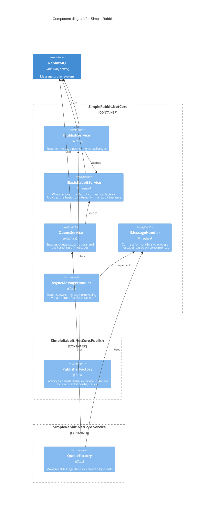

# SimpleRabbit

An easy wrapper for the RabbitMQ client that allows inclusion in DotNetCore projects. Can be used with the standard dependency injection provided in DotNetCore.

## Getting started

### Package Install

There are two packages on Nuget.

1. SimpleRabbit.Netcore <- has the basics to be able to publish - and listen to queues where not hosting.
2. SimpleRabbit.Netcore.Publish <- has extensions to allow for easier injection in DotNetCore and a factory allowing for multi-cluster rabbit publishing
3. SimpleRabbit.Netcore.Service <- has the IHostedService option for running as a host to listen to queues.

Installing is as easy as: `dotnet add package SimpleRabbit.NetCore` or `Install-Package SimpleRabbit.NetCore` depending on your setup.

### Component Diagram

Below is a [C4 Component diagram](https://en.wikipedia.org/wiki/C4_model#Overview) of the Simple Rabbit library: 



## Contributing 

Please fork this repo then create a PR from the fork into the original one. 

## Usage

### Publishing

[sample project](Examples/Publisher)

```csharp
private static void Main()
{
    var configuration = new ConfigurationBuilder()
        .AddJsonFile("appsettings.json", true)
        .Build();

    var services = new ServiceCollection();
    services
        .AddPublisherServices()
        .AddRabbitConfiguration(configuration.GetSection("RabbitConfiguration"))

    var provider = services.BuildServiceProvider();

    var publisher = provider.GetService<IPublishService>();
    publisher.Publish(exchange: "ExchangeName", body: "Test body");
}
```

The corresponding appsettings.json file (to provide connectivity to rabbit):

```json
{
    "RabbitConfiguration": {
        "Username": "username",
        "Password": "password",
        "VirtualHost": "/",
        "Hostnames": [
            "host1",
            "host2"
        ]
    }
}
```

### Subscribing

[sample project](Examples/Subscriber.Service)

```csharp
public static async Task Main(string[] args)
{
    var builder = new HostBuilder()
        .ConfigureAppConfiguration((hostingContext, config) =>
        {
            config.AddJsonFile("appsettings.json", true);
        })
        .ConfigureServices((context, services) =>
        {
            var config = context.Configuration;
            services
                .AddRabbitConfiguration(config.GetSection("RabbitConfiguration"))
                .AddSubscriberConfiguration(config.GetSection("Subscribers"))
                .AddSubscriberServices();
                .AddSingletonMessageHandler<MessageProcessor>()
        });

    await builder.RunConsoleAsync();
}
```

The message handler is chosen based on the CanProcess call. The consumer tag is passed in i.e. tags are matched not queues. This allows a handler to handle multiple messages from multiple queues.

```csharp
internal class MessageProcessor : IMessageHandler
{
    public bool CanProcess(string tag)
    {
        /* validate whether this handler will handle this tag */
        return true;
    }

    public bool Process(BasicMessage message)
    {
        var body = message.Body;

        if (string.IsNullOrWhiteSpace(body))
        {
            Console.WriteLine($"Message contents: {body}");
        }
        else
        {
            Console.WriteLine($"Empty message: {message.MessageId}")
        }
        /* return false will have the message Nack'd and requeued.
            It can be acked later on*/
        return true;
    }
}
```

Subscribers are a list (of queues to consume), and they are auto wired up to the queue and are eventing based. The `ConsumerTag` is the tag passed to `CanProcess(string tag)`

```json
{
    "RabbitConfiguration": {
        "Username": "username",
        "Password": "password",
        "VirtualHost": "/",
        "Hostnames": [
            "host1",
            "host2"
        ]
    },
    "Subscribers": [
        {
            "ConsumerTag": "TestTagName",
            "QueueName": "Test"
        }
    ]
}
```

### Multiple Rabbit clusters

[Multi-Publishing](Examples/Multi-Publisher)
[Multi-Subscribing](Examples/Multi-Subscriber.Service)

There is additional factories that can make use of multiple configurations. The setup for the publisher factory is as follows

```csharp
public class Program
{
    public static void Main(string[] args)
    {
        var configuration = new ConfigurationBuilder()
            .AddJsonFile("appsettings.json", true)
            .Build();

        PublishService PublisherFactory(IServiceProvider service, string name)
        {
            var p = service.GetService<PublishService>();
            p.ConfigurationName = name;
            return p;
        }

        services
            .AddRabbitConfiguration("name1", configuration.GetSection("RabbitConfigurations:Configuration1"))
            .AddRabbitConfiguration("name2", configuration.GetSection("RabbitConfigurations:Configuration2"))
            .AddPublisherFactory();

        var provider = services.BuildServiceProvider();

        //Publishing is based on the configuration name provided
        var publisher = provider.GetService<List<IPublishService>>().FirstOrDefault(p => p.ConfigurationName.Equals("name1"));
        publisher?.Publish(exchange: "ExchangeName", body: "Test body");
    }
}
```

The `appsettings.json` file will look something like this:

```json
{
  "RabbitConfiguration": {
    "Configuration1": {
        "Username": "username",
        "Password": "password",
        "VirtualHost": "/",
        "Hostnames": [
            "host1",
            "host2"
        ]
    },
    "Configuration2": {
        "Username": "username",
        "Password": "password",
        "VirtualHost": "/",
        "Hostnames": [
            "host1",
            "host2"
        ]
    }
  }
}
```

Note: the multiple configuration setup uses IOptionMonitor, which will listen to changes, invalidating a connection if the configuration is changed in runtime.

### Multi-Subscriber

Multiple cluster subscribing only requires additional registrations of configurations. This will also invalidate and respawn connections on configuration update like publishing.

```csharp
 services
    .AddRabbitConfiguration("name",config.GetSection("RabbitConfiguration"))
    .AddSubscriberConfiguration("name",config.GetSection("Subscribers"))
```

Note : The names of the configuration will be used to match the list of queues and rabbit configuration together.

### Local Rabbit

Within the RabbitMQ server [folder](RabbitMQ%20server) there contains a docker build of a pre-configured rabbit server, able to run the example projects.

Within that directory, run the following bash command to start the server: 

```shell
docker build -t localrabbit . && 
docker run -p 5672:5672 -p 15672:15672 localrabbit
```
