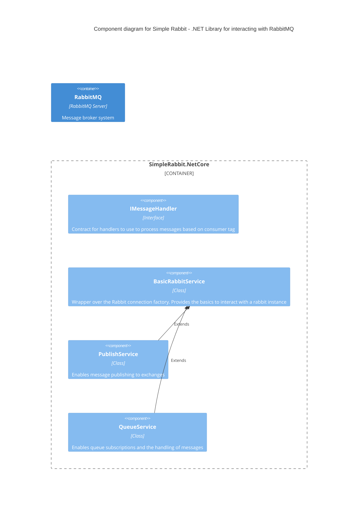

a grouping of related functionality encapsulated behind a well-defined interface. If you're using a language like Java or C#, the simplest way to think of a component is that it's a collection of implementation classes behind an interface.

